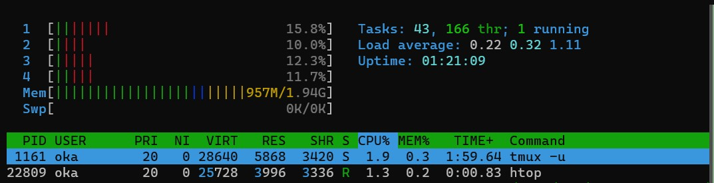

# 第0章

<blockquote class="twitter-tweet">
MikanOS (みかのすと読むらしい) を WSL2 でビルドして QEMU で動かした～ WSL2 のメモリ消費バグがつらい<a href="https://twitter.com/hashtag/%E3%82%BC%E3%83%AD%E3%81%8B%E3%82%89%E3%81%AEOS%E8%87%AA%E4%BD%9C%E5%85%A5%E9%96%80?src=hash&amp;ref_src=twsrc%5Etfw">#ゼロからのOS自作入門</a> <a href="https://t.co/OMFjuo9BcI">pic.twitter.com/OMFjuo9BcI</a>
&mdash; oka ఒక (@nowohyeah) <a href="https://twitter.com/nowohyeah/status/1375863342535860224?ref_src=twsrc%5Etfw">March 27, 2021</a></blockquote> 

WSL2 のメモリ枯渇問題については以下の記事のように対処すれば良いことが分かった。

- [WSL2によるホストのメモリ枯渇を防ぐための暫定対処 - Qiita](https://qiita.com/yoichiwo7/items/e3e13b6fe2f32c4c6120)

RAM 4 GB の人権無視マシンを使っているので、 WSL への割り当ては 2 GB とした。 WSL2 再起動後に `htop` すると 2 GB になっていることが分かる。

