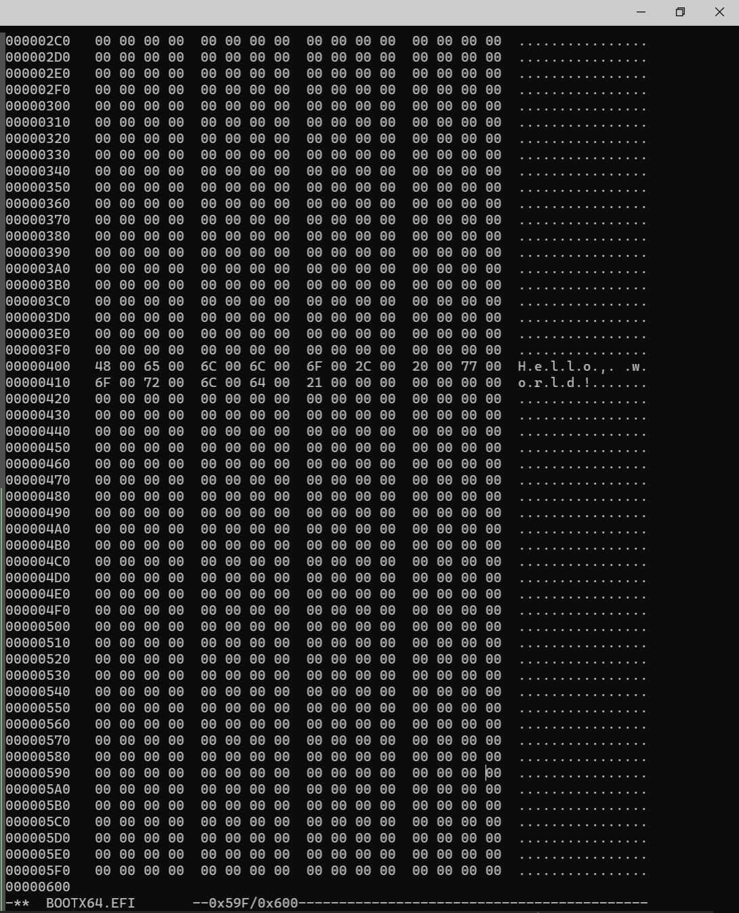

# 第1章

binary editor で EFI file を作って QEMU で動かすのを目標にする。 USB メモリとかは面倒なのでやらない。けっこう進んだらやってみてもよいけど。

## EFI ファイル作成

binary editor は本では okteta や  Binary Editor Bz が紹介されているが、 CLI で使える hexedit でやってみる。

```sh
sudo apt install hexedit
touch BOOTX64.EFI
hexedit BOOTX64.EFI
```

打ち込んでいるところ



## QEMU で起動

本当は qemu の command を打たないといけないが、用意されている [script](https://github.com/uchan-nos/mikanos-build/blob/master/devenv/run_qemu.sh) を使う。

```
$HOME/osbook/devenv/run_qemu.sh BOOTX64.EFI
```

まごころこめて手打ちした binary が起動すると感慨もひとしお。


## C 言語で hello world

```sh
cd $HOME/osbook/day01/c
clang -target x86_64-pc-win32-coff -mno-red-zone -fno-stack-protector -fshort-wchar -Wall -c hello.c
lld-link /subsystem:efi_application /entry:EfiMain /out:hello.efi hello.o
$HOME/osbook/devenv/run_qemu.sh hello.efi
```

でさっきと同様に Hello world が表示される。

```sh
cmp BOOTX64.EFI ~/osbook/day01/c/hello.efi
```

で binary を比較すると

> differ: byte 3, line 1

と出た。 `hexedit` で開くとその他の場所もけっこう違っていた。
