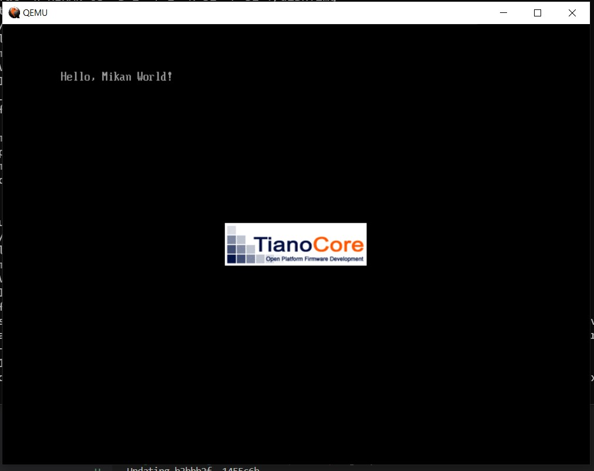

# 第2章

## 2.2 EDK II でハローワールド

EDK II を使うと色々簡単に書けるらしい。 p.50, 51 の指示に従い build したあと、

```sh
$HOME/osbook/devenv/run_qemu.sh $HOME/edk2/Build/MikanLoaderX64/DEBUG_CLANG38/X64/Loader.efi
```

を実行すると、



が表示される。

最近 C/C++ 書かないのでインクルードガードとか久しぶりに思い出した (コラム 2.1)。

## 2.7 メモリマップの確認

本の指示に従って MikanOS を build し、 QEMU で起動する。起動後にできた `disk.img` を mount してその中の `memmap` という CSV file を確認すると以下のようになっていた。

```sh
$ cat mnt/memmap
Index, Type, Type(name), PhysicalStart, NumberOfPages, Attribute
0, 3, EfiBootServicesCode, 00000000, 1, F
1, 7, EfiConventionalMemory, 00001000, 9F, F
2, 7, EfiConventionalMemory, 00100000, 700, F
3, A, EfiACPIMemoryNVS, 00800000, 8, F
4, 7, EfiConventionalMemory, 00808000, 8, F
5, A, EfiACPIMemoryNVS, 00810000, F0, F
6, 4, EfiBootServicesData, 00900000, B00, F
7, 7, EfiConventionalMemory, 01400000, 3AB36, F
8, 4, EfiBootServicesData, 3BF36000, 20, F
9, 7, EfiConventionalMemory, 3BF56000, 270F, F
10, 1, EfiLoaderCode, 3E665000, 2, F
11, 4, EfiBootServicesData, 3E667000, 217, F
12, 3, EfiBootServicesCode, 3E87E000, B6, F
13, A, EfiACPIMemoryNVS, 3E934000, 12, F
14, 0, EfiReservedMemoryType, 3E946000, 1C, F
15, 3, EfiBootServicesCode, 3E962000, 10A, F
16, 6, EfiRuntimeServicesData, 3EA6C000, 5, F
17, 5, EfiRuntimeServicesCode, 3EA71000, 5, F
18, 6, EfiRuntimeServicesData, 3EA76000, 5, F
19, 5, EfiRuntimeServicesCode, 3EA7B000, 5, F
20, 6, EfiRuntimeServicesData, 3EA80000, 5, F
21, 5, EfiRuntimeServicesCode, 3EA85000, 7, F
22, 6, EfiRuntimeServicesData, 3EA8C000, 8F, F
23, 4, EfiBootServicesData, 3EB1B000, 4DA, F
24, 7, EfiConventionalMemory, 3EFF5000, 4, F
25, 4, EfiBootServicesData, 3EFF9000, 6, F
26, 7, EfiConventionalMemory, 3EFFF000, 1, F
27, 4, EfiBootServicesData, 3F000000, A1B, F
28, 7, EfiConventionalMemory, 3FA1B000, 1, F
29, 3, EfiBootServicesCode, 3FA1C000, 17F, F
30, 5, EfiRuntimeServicesCode, 3FB9B000, 30, F
31, 6, EfiRuntimeServicesData, 3FBCB000, 24, F
32, 0, EfiReservedMemoryType, 3FBEF000, 4, F
33, 9, EfiACPIReclaimMemory, 3FBF3000, 8, F
34, A, EfiACPIMemoryNVS, 3FBFB000, 4, F
35, 4, EfiBootServicesData, 3FBFF000, 201, F
36, 7, EfiConventionalMemory, 3FE00000, 8D, F
37, 4, EfiBootServicesData, 3FE8D000, 20, F
38, 3, EfiBootServicesCode, 3FEAD000, 20, F
39, 4, EfiBootServicesData, 3FECD000, 9, F
40, 3, EfiBootServicesCode, 3FED6000, 1E, F
41, 6, EfiRuntimeServicesData, 3FEF4000, 84, F
42, A, EfiACPIMemoryNVS, 3FF78000, 88, F
43, 6, EfiRuntimeServicesData, FFC00000, 400, 1
```

なお `mkdir -p mnt` とすると `mnt` が既に存在していても error にならないと初めて知った！ 今まで `if [ -e mnt ]; then mkdir mnt; fi` ってやってたよ。。
