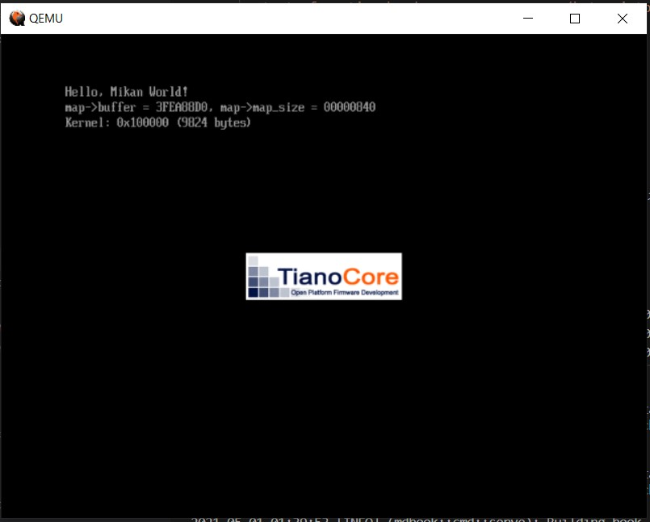

# 第3章

## 3.3 初めてのカーネル

p. 73 の手順で kernel file を作成する。これが初めての OS で、これまで動かしていたのは boot loader らしい。  
kernel の情報は `readelf` で見れる (`-h` は header を表示する option)。


```sh
$ readelf -h kernel.elf
ELF Header:
  Magic:   7f 45 4c 46 02 01 01 00 00 00 00 00 00 00 00 00
  Class:                             ELF64
  Data:                              2's complement, little endian
  Version:                           1 (current)
  OS/ABI:                            UNIX - System V
  ABI Version:                       0
  Type:                              EXEC (Executable file)
  Machine:                           Advanced Micro Devices X86-64
  Version:                           0x1
  Entry point address:               0x101000
  Start of program headers:          64 (bytes into file)
  Start of section headers:          8928 (bytes into file)
  Flags:                             0x0
  Size of this header:               64 (bytes)
  Size of program headers:           56 (bytes)
  Number of program headers:         4
  Size of section headers:           64 (bytes)
  Number of section headers:         14
  Section header string table index: 12
```

kernel を boot loader で動かすには p. 80 の手順を実行する。なおこの部分は、4行目に `source edksetup.sh` が入るべきなのが抜けていると思われる。  

```sh
$ $HOME/osbook/devenv/run_qemu.sh $HOME/edk2/Build/MikanLoaderX64/DEBUG_CLANG38/X64/Loader.efi $HOME/osbook/mikanos/kernel/kernel.elf
```

を実行すると以下のように表示された。



terminal で QEMU モニタを以下のように動かせた。

```
(qemu) info registers
RAX=0000000000100000 RBX=000000003effef18 RCX=0000000000000000 RDX=0000000000000000
RSI=000000003feaca08 RDI=000000003feac9e0 RBP=000000003fea8850 RSP=000000003fea8850
R8 =000000003fea87c4 R9 =000000003fb7b48f R10=000000003fbcd018 R11=fffffffffffffffc
R12=000000003effe920 R13=000000003feac8d0 R14=000000003fea9110 R15=000000003e66573c
RIP=0000000000101011 RFL=00000046 [---Z-P-] CPL=0 II=0 A20=1 SMM=0 HLT=1
ES =0030 0000000000000000 ffffffff 00cf9300 DPL=0 DS   [-WA]
CS =0038 0000000000000000 ffffffff 00af9a00 DPL=0 CS64 [-R-]
SS =0030 0000000000000000 ffffffff 00cf9300 DPL=0 DS   [-WA]
DS =0030 0000000000000000 ffffffff 00cf9300 DPL=0 DS   [-WA]
FS =0030 0000000000000000 ffffffff 00cf9300 DPL=0 DS   [-WA]
GS =0030 0000000000000000 ffffffff 00cf9300 DPL=0 DS   [-WA]
LDT=0000 0000000000000000 0000ffff 00008200 DPL=0 LDT
TR =0000 0000000000000000 0000ffff 00008b00 DPL=0 TSS64-busy
GDT=     000000003fbee698 00000047
IDT=     000000003f306018 00000fff
CR0=80010033 CR2=0000000000000000 CR3=000000003fc01000 CR4=00000668
DR0=0000000000000000 DR1=0000000000000000 DR2=0000000000000000 DR3=0000000000000000
DR6=00000000ffff0ff0 DR7=0000000000000400
EFER=0000000000000500
FCW=037f FSW=0000 [ST=0] FTW=00 MXCSR=00001f80
FPR0=0000000000000000 0000 FPR1=0000000000000000 0000
FPR2=0000000000000000 0000 FPR3=0000000000000000 0000
FPR4=0000000000000000 0000 FPR5=0000000000000000 0000
FPR6=0000000000000000 0000 FPR7=0000000000000000 0000
XMM00=00000000000000000000000000000000 XMM01=00000000000000000000000000000000
XMM02=00000000000000000000000000000000 XMM03=00000000000000000000000000000000
XMM04=00000000000000000000000000000000 XMM05=00000000000000000000000000000000
XMM06=00000000000000000000000000000000 XMM07=00000000000000000000000000000000
XMM08=00000000000000000000000000000000 XMM09=00000000000000000000000000000000
XMM10=00000000000000000000000000000000 XMM11=00000000000000000000000000000000
XMM12=00000000000000000000000000000000 XMM13=00000000000000000000000000000000
XMM14=00000000000000000000000000000000 XMM15=00000000000000000000000000000000
(qemu)
(qemu) x /2i 0x101011
0x0000000000101011:  jmp    0x101010
0x0000000000101013:  int3
(qemu) 
(qemu) x /2i 0x101010
0x0000000000101010:  hlt
0x0000000000101011:  jmp    0x101010
```
